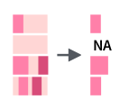

# Работа со строками {#strings}

## Работа со строками в R

Для работы со строками можно использовать:

* базовый R
* пакет `stringr` (часть `tidyverse`)
* пакет `stringi` -- отдельный пакет, так что не забудьте его установить:

```{r}
library(tidyverse)
library(stringi)
```

Мы будем пользоваться в основном пакетами `stingr` и `stringi`, так как они в большинстве случаях удобнее. К счастью функции этих пакетов легко отличить от остальных: функции пакет `stringr` всегда начинаются с `str_`, а функции пакета `stringi` --- c `stri_`.

Существует [cheat sheet по `stringr`](https://github.com/rstudio/cheatsheets/raw/master/strings.pdf).

## Как получить строку?

* следите за кавычками
```{r}
"the quick brown fox jumps over the lazy dog"
'the quick brown fox jumps over the lazy dog'
"the quick 'brown' fox jumps over the lazy dog"
'the quick "brown" fox jumps over the lazy dog'
```

* пустая строка
```{r}
""
''
character(3)
```

* преобразование
```{r}
typeof(4:7)
as.character(4:7)
```

* встроенные векторы
```{r}
letters
LETTERS
month.name
```

* Создание рандомных строк
```{r}
set.seed(42)
stri_rand_strings(n = 10, length = 5:14)
```

* Перемешивает символы внутри строки
```{r}
stri_rand_shuffle("любя, съешь щипцы, — вздохнёт мэр, — кайф жгуч")
stri_rand_shuffle(month.name)
```

* Генерирует псевдорандомный текст ^[Lorem ipsum --- классический текст-заполнитель на основе трактата Марка Туллия Цицерона "О пределах добра и зла". Его используют, чтобы посмотреть, как страница смотриться, когда заполнена текстом]
```{r}
stri_rand_lipsum(nparagraphs = 2)
```

## Соединение и разделение строк

Соединенить строки можно используя функцию `str_c()`, в которую, как и в функции `с()`, можно перечислять элементы через запятую:
```{r}
tibble(upper = rev(LETTERS), smaller = letters) %>% 
  mutate(merge = str_c(upper, smaller))
```

Кроме того, если хочется, можно использовать особенный разделитель, указав его в аргументе `sep`:

```{r}
tibble(upper = rev(LETTERS), smaller = letters) %>% 
  mutate(merge = str_c(upper, smaller, sep = "_"))
```

Аналогичным образом, для разделение строки на подстроки можно использовать функцию `separate()`. Это функция разносит разделенные элементы строки в соответствующие столбцы. У функции три обязательных аргумента: `col` --- колонка, которую следует разделить, `into` --- вектор названий новых столбец, `sep` --- разделитель.

```{r}
tibble(upper = rev(LETTERS), smaller = letters) %>% 
  mutate(merge = str_c(upper, smaller, sep = "_")) %>% 
  separate(col = merge, into = c("column_1", "column_2"), sep = "_")
```

Кроме того, есть инструмент `str_split()`, которая позволяет разбивать строки на подстроки, но возвращает *список*.

```{r}
str_split(month.name, "r")
```


## Количество символов

### Подсчет количества символов


```{r}
tibble(mn = month.name) %>% 
  mutate(n_charactars = str_count(mn))
```

### Подгонка количества символов

Можно обрезать строки, используя функцию `str_trunc()`:


```{r}
tibble(mn = month.name) %>% 
  mutate(mn_new = str_trunc(mn, 6))
```

Можно решить с какой стороны обрезать, используя аргумент `side`:
```{r}
tibble(mn = month.name) %>% 
  mutate(mn_new = str_trunc(mn, 6, side = "left"))
tibble(mn = month.name) %>% 
  mutate(mn_new = str_trunc(mn, 6, side = "center"))
```

Можно заменить многоточие, используя аргумент `ellipsis`:
```{r}
tibble(mn = month.name) %>% 
  mutate(mn_new = str_trunc(mn, 3, ellipsis = ""))
```

Можно наоборот "раздуть" строку:


```{r}
tibble(mn = month.name) %>% 
  mutate(mn_new = str_pad(mn, 10))
```

Опять же есть аргумент `side`:
```{r}
tibble(mn = month.name) %>% 
  mutate(mn_new = str_pad(mn, 10,  side = "right"))
```

Также можно выбрать, чем "раздувать строку":

```{r}
tibble(mn = month.name) %>% 
  mutate(mn_new = str_pad(mn, 10,  pad = "."))
```


```{block, type = "rmdtask"}
На Pudding вышла [статья про английские пабы](https://pudding.cool/2019/10/pubs/). [Здесь](https://raw.githubusercontent.com/agricolamz/DS_for_DH/master/data/UK_pubs.csv) лежит немного обработанный датасет, которые они использовали. Визуализируйте 40 самых частотоных названий пабов в Великобритании, отложив по оси x количество символов, а по оси y -- количество баров с таким названием.
```

```{r, echo=FALSE, message = FALSE}
read_csv("https://raw.githubusercontent.com/agricolamz/DS_for_DH/master/data/UK_pubs.csv") %>% 
  count(pub_name, sort = TRUE) %>% 
  mutate(nchar = str_length(pub_name)) %>% 
  slice(1:40) %>% 
  ggplot(aes(nchar, n, label = pub_name))+
  geom_point()+
  ggrepel::geom_text_repel()+
  labs(x = "number of symbols",
       y = "number of bars",
       titles = "40 most popular bar names in UK",
       caption = "data from https://pudding.cool/2019/10/pubs/")
```

## Сортировка
Для сортировки существует базовая функция `sort()` и функция из `stringr` `str_sort()`:

```{r}
unsorted_latin <- c("I", "♥", "N", "Y")
sort(unsorted_latin)
str_sort(unsorted_latin)
str_sort(unsorted_latin, locale = "lt")
unsorted_cyrillic <- c("я", "i", "ж")
str_sort(unsorted_cyrillic)
str_sort(unsorted_cyrillic, locale = "ru_UA")
```

Список локалей на копмьютере можно посмотреть командой `stringi::stri_locale_list()`. Список всех локалей вообще приведен [на этой странице](https://en.wikipedia.org/wiki/List_of_ISO_639-1_codes). Еще полезные команды: `stringi::stri_locale_info` и `stringi::stri_locale_set`.

Не углубляясь в [разнообразие алгоритмов сортировки](https://www.youtube.com/watch?v=BeoCbJPuvSE), отмечу, что алгоритм по-умолчанию хуже работает с большими данными:

```{r, cache=TRUE}
set.seed(42)
huge <- sample(letters, 1e7, replace = TRUE)
head(huge)
system.time(
  sort(huge)
)

system.time(
  sort(huge, method = "radix")
)

system.time(
  str_sort(huge)
)

huge_tbl <- tibble(huge)
system.time(
  huge_tbl %>% 
    arrange(huge)
)
```


Предварительный вывод: для больших данных -- `sort(..., method = "radix")`.

## Поиск подстроки
Можно использовать функцию `str_detect()`:


```{r}
tibble(mn = month.name) %>% 
  mutate(has_r = str_detect(mn, "r"))
```

Кроме того, существует функция, которая возвращает индексы, а не значения `TRUE`/`FALSE`:


```{r}
tibble(mn = month.name) %>% 
  slice(str_which(mn, "r"))
```

Также можно посчитать количество вхождений какой-то подстроки:


```{r}
tibble(mn = month.name) %>% 
  mutate(has_r = str_count(mn, "r"))
```

## Изменение строк
### Изменение регистра
```{r}
latin <- "tHe QuIcK BrOwN fOx JuMpS OvEr ThE lAzY dOg"
cyrillic <- "лЮбЯ, сЪеШь ЩиПцЫ, — вЗдОхНёТ мЭр, — кАйФ жГуЧ"
str_to_upper(latin)
str_to_lower(cyrillic)
str_to_title(latin)
```

### Выделение подстроки
Подстроку в строке можно выделить двумя способами: по индексам функцией `str_sub()`, и по подстроке функцией `str_png()`.

extract(images/5.07_str_sub.png)

```{r}
tibble(mn = month.name) %>% 
  mutate(mutate = str_sub(mn, start = 1, end = 2))
```

      

```{r}
tibble(mn = month.name) %>% 
  mutate(mutate = str_extract(mn, "r"))
```

По умолчанию функция `str_extract()` возвращает первое вхождение подстроки, соответствующей шаблону. Также существует функция `str_extract_all()`, которая возвращает все вхождения подстрок, соответствующих шаблону, однако возвращает объект типа список.

```{r}
str_extract_all(month.name, "r")
```

### Замена подстроки

Существует функция `str_replace()`, которая позволяет заменить одну подстроку в строке на другую:


```{r}
tibble(mn = month.name) %>% 
  mutate(mutate = str_replace(mn, "r", "R"))
```

Как и другие функции `str_replace()` делает лишь одну замену, чтобы заменить все вхождения подстроки следует использовать функцию `str_replace_all()`:


```{r}
tibble(mn = month.name) %>% 
  mutate(mutate = str_replace_all(mn, "r", "R"))
```

### Удаление подстроки
Для удаления подстроки на основе шаблона, используется функция `str_remove()` и `str_remove_all()`

```{r}
tibble(month.name) %>% 
  mutate(mutate = str_remove(month.name, "r"))
tibble(month.name) %>% 
  mutate(mutate = str_remove_all(month.name, "r"))
```

### Транслитерация строк

В пакете `stringi` сууществует достаточно много методов транслитераций строк, которые можно вывести командой `stri_trans_list()`. Вот пример использования некоторых из них:

```{r}
stri_trans_general("stringi", "latin-cyrillic")
stri_trans_general("сырники", "cyrillic-latin")
stri_trans_general("stringi", "latin-greek")
stri_trans_general("stringi", "latin-armenian")
```

```{block, type = "rmdtask"}
Вот два датасета:

* [список городов России](https://raw.githubusercontent.com/agricolamz/DS_for_DH/master/data/cities_of_russia.csv)
* [частотный словарь русского языка [Шаров, Ляшевская 2011]](https://raw.githubusercontent.com/agricolamz/DS_for_DH/master/data/freq_dict_2011.csv)

Определите сколько городов называется обычным словом русского языка (например, город Орёл)? Не забудьте поменять ё на е.
```

```{r, cache=TRUE, include=FALSE, eval=FALSE}
read_csv("https://raw.githubusercontent.com/agricolamz/DS_for_DH/master/data/cities_of_russia.csv") %>% 
  mutate(city = str_to_lower(city),
         city = str_replace_all(city, "ё", "е")) ->
  cities

read_tsv("https://raw.githubusercontent.com/agricolamz/DS_for_DH/master/data/freq_dict_2011.csv") %>% 
  inner_join(cities, by = c("lemma" = "city")) %>% 
  count(lemma)
# 65
```


```{block, type = "rmdtask"}
[Вот отсюда](https://raw.githubusercontent.com/agricolamz/DS_for_DH/master/data/zabolockiy_merknut_znaki_zodiaka.txt) можно скачать файл с текстом стихотворения Н. Заболоцкого "Меркнут знаки задиака". Посчитайте долю женских (ударение падает на **предпоследний** слог рифмующихся слов) и мужских (ударение падает на **последний** слог рифмующихся слов) рифм в стихотворении.
```

```{r, cache=TRUE, include=FALSE}
text <- read_lines("https://raw.githubusercontent.com/agricolamz/DS_for_DH/master/data/zabolockiy_merknut_znaki_zodiaka.txt")
tibble(text = text) %>% 
  filter(text != "") %>% 
  mutate(n_vowels = str_count(text, "[яёуеыаоэюиЯЁУЕЫАОЭЮИ]")) %>% 
  count(n_vowels) %>% 
  mutate(ratio = n/sum(n))
```


```{block, type = "rmdtask"}
В ходе анализа данных чаще всего бороться со строками и регулярными выражениями приходится в процессе обработки неаккуратнособранных анкет. Предлагаю обработать переменные `sex` и `age` [такой вот неудачно собранной анкеты](https://raw.githubusercontent.com/agricolamz/DS_for_DH/master/data/mad_questionary.csv) и построить следующий график:
```


```{r cache=TRUE, include=FALSE}
read_csv("https://raw.githubusercontent.com/agricolamz/DS_for_DH/master/data/mad_questionary.csv") %>% 
  mutate(sex = str_replace_all(sex, "^[Жж].*", "женский"),
         sex = str_replace_all(sex, "^[Мм].*", "мужской"),
         age = str_remove_all(age, " лет"),
         age = as.integer(age)) %>%
  ggplot(aes(age, fill = sex))+
  geom_dotplot(method = "histodot")+
  scale_y_continuous(NULL, breaks = NULL) # чтобы убрать ось y
```

## Определение языка

Для определения языка существует два пакета `cld2` (вероятностный) и `cld3` (нейросеть).

```{r, cache=TRUE}
udhr_24 <- read_csv("https://raw.githubusercontent.com/agricolamz/DS_for_DH/master/data/article_24_from_UDHR.csv")
udhr_24
cld2::detect_language(udhr_24$article_text)
cld2::detect_language(udhr_24$article_text, lang_code = FALSE)
cld3::detect_language(udhr_24$article_text)
cld2::detect_language("Ты женат? Говорите ли по-английски?")
cld3::detect_language("Ты женат? Говорите ли по-английски?")
cld2::detect_language("Варкалось. Хливкие шорьки пырялись по наве, и хрюкотали зелюки, как мюмзики в мове.")
cld3::detect_language("Варкалось. Хливкие шорьки пырялись по наве, и хрюкотали зелюки, как мюмзики в мове.")
cld2::detect_language("Варчилось… Хлив'язкі тхурки викрули, свербчись навкрузі, жасумновілі худоки гривіли зехряки в чузі.")
cld3::detect_language("Варчилось… Хлив'язкі тхурки викрули, свербчись навкрузі, жасумновілі худоки гривіли зехряки в чузі.")
cld2::detect_language_mixed("Многие в нашей команде OpenDataScience занимаются state-of-the-art технологиями машинного обучения: DL-фреймворками, байесовскими методами машинного обучения, вероятностным программированием и не только.")
cld3::detect_language_mixed("Многие в нашей команде OpenDataScience занимаются state-of-the-art технологиями машинного обучения: DL-фреймворками, байесовскими методами машинного обучения, вероятностным программированием и не только.")
```

## Расстояния между строками
Существует много разных метрик для измерения расстояния между строками (см. <code>?&grave;stringdist-metrics&grave;</code>), в примерах используется расстояние Дамерау — Левенштейна. Данное расстояние получается при подсчете количества операций, которые нужно сделать, чтобы перевести одну строку в другую.

* вставка ab → aNb
* удаление aOb → ab
* замена символа aOb → aNb
* перестановка символов ab → ba

```{r}
library(stringdist)
stringdist("корова","корова")
stringdist("коровы", c("курица", "бык", "утка", "корова", "осел"))
amatch(c("быки", "коровы"), c("курица", "бык", "утка", "корова", "осел"), maxDist = 2)
```

## Дополнительные задания:

```{block, type = "rmdtask"}
В [датасет](https://github.com/agricolamz/2020-2021-ds4dh/raw/master/data/realdonaldtrump.csv) записаны твиты Донольда Трампа взятые с [kaggle](https://www.kaggle.com/austinreese/trump-tweets). Постройте график рассеяния, которые показывает связь количества ретвитов и лайков. Чтобы убрать научную запись больших чисел используйте команду `options(scipen = 999)`.
```

```{r trump, echo = FALSE, cache=TRUE, message=FALSE}
tr <- read_csv("https://github.com/agricolamz/2020-2021-ds4dh/raw/master/data/realdonaldtrump.csv")

theme_set(theme_bw())

options(scipen = 999)
tr %>% 
  ggplot(aes(retweets, favorites))+
  geom_point(alpha = 0.2)+
  labs(caption = "data from www.kaggle.com/austinreese/trump-tweets")
```

```{block, type = "rmdtask"}
Постройте график рассеивания, который бы показывал связь с длиной твита во времени. Используя `geom_hline()`, наложите две линии: 140 символов и 280. Сделайте прозрачность 0.1.
```

```{r, echo = FALSE}
tr %>% 
  mutate(length = nchar(content)) %>% 
  ggplot(aes(date, length))+
  geom_point(alpha = 0.1)+
  geom_hline(yintercept = 140, color = "red")+
  geom_hline(yintercept = 280, color = "darkgreen")+
  theme_bw()+
  labs(caption = "data from www.kaggle.com/austinreese/trump-tweets",
       x = "")
```

```{block, type = "rmdtask"}
Постройте график рассеивания, который бы показывал связь с длиной твита во времени. Разбейте и раскрасьте твиты на основании наличия в них интернет ссылок.
```

```{r, echo = FALSE}
tr %>% 
  mutate(length = nchar(content),
         link = str_detect(content, "https?")) %>% 
  ggplot(aes(date, length, color = link))+
  geom_point(alpha = 0.5)+
  theme_bw()+
  facet_wrap(~link) +
  labs(caption = "data from www.kaggle.com/austinreese/trump-tweets",
       x = "",
       color = "with link")
```

```{block, type = "rmdtask"}
Можно ли утверждать, что твиты со ссылками длиннее? Постройте вайолинплот, которые показывает распределение значений длины твитов в зависимости от наличия в них интернет ссылок.
```

```{r, echo = FALSE}
tr %>% 
  mutate(length = nchar(content),
         link = str_detect(content, "https?")) %>% 
  ggplot(aes(link, length, fill = link))+
  geom_violin()+
  theme_bw()+
  labs(caption = "data from www.kaggle.com/austinreese/trump-tweets",
       x = "",
       fill = "with link")
```


```{block, type = "rmdtask"}
Найдите твиты которые содержат корень america, которые встречаются больше одного раза, и фасетизируйте по таким словам.
```

```{r, echo = FALSE}
tr %>% 
  mutate(length = nchar(content),
         america = str_extract(str_to_lower(content), "america\\w*\\W"),
         america = str_sub(america, start = 1, end = -2)) %>% 
  add_count(america, sort = TRUE) %>% 
  filter(n > 1,
         !is.na(america)) %>% 
  ggplot(aes(date, length, color = america))+
  geom_point()+
  facet_wrap(~america)+
  theme_bw()+
  labs(caption = "data from www.kaggle.com/austinreese/trump-tweets",
       x = "",
       fill = "with link")
```
