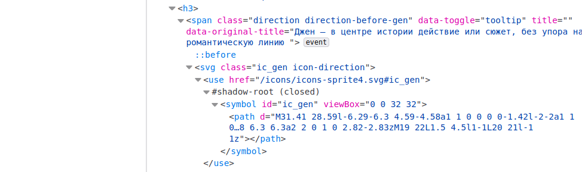
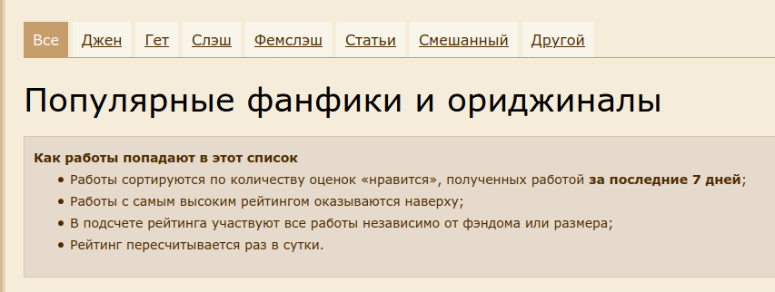

```{r setup03, include=FALSE}
knitr::opts_chunk$set(message = FALSE, warning = FALSE, comment = "")
library(tidyverse)
theme_set(theme_bw())
```

# Сбор данных из интернета: `rvest`

```{r, message=FALSE}
library(tidyverse)
```

Достаточно часто данные не ходят упакованные в готовые файлы `.csv` или `.json`. Иногда данные лежат в открытом доступе на какой-нибудь странице в интернете. А иногда никто и не думал, что что-то станет данными: заголовки и тексты новостей, комментарии, твиты и т. п. В этом разделе мы обсудим основы извлечения данных из вебстраниц.

## Введение

Любая `html`-документ --- это обычный xml файл, т. е. такой иерархически устроенный тип данных, где у каждого узла (кроме корневого) есть родительский узел и могут быть дочерние узлы и дополнительные атрибуты.  Обычно самый верхний узел называется `html`, который имеет два дочерних узла `head` и `body`. Каждый html-документ является инструкцией для браузера, в которой говориться что и в каком порядке нужно отображать, но одновременно эта инструкция является кодом, который мы можем посмотреть. В большинстве браузеров это можно сделать при помощи горячих клавиш `Ctrl+U`, в Apple Safari --- `Cmd+Option+U`. Кроме того есть режим разработчика, который позволяет делать много всего, в том числе наводить на какой-то объект в браузере и узнавать какой фрагмент кода ему соответствует (этот режим можно вызвать, нажав `F12` или `Ctrl+Shift+I`, в Apple Safari вроде нет горячих клавиш и нужно вызывать как-то из меню). Большинство узлов `html`-документа состоят из

* тег узла, например, `p`
* значения узла, например, `Жили-были три медведя.`
* `id` (уникальные объекты в `html`-документе), `class` (неуникальные объекты в `html`-документе) и другием атрибуты узла

Например:

```
<p class="story" some_atribute = 42>Жили-были три медведя.</p>
```

Некоторые `html`-документ не являются статическими и изменяются после того, как страница была открыта при помощи JavaScript'а. Это динамичность может быть скрытой, когда пользователь лишь видит, как открывается страница, а иногда может быть завязана на некоторые действия пользователя. Информацию со статических страниц собирать достаточно просто и для этого нам хватит пакета `rvest`. C динамическими сайтами все иногда несколько сложнее. Иногда на динамических страницах можно отследить источник данных, посмотрев вкладку `Network` в режиме разработчика (ведь откуда-то эти данные появляются в браузере, правда?). Иногда необходимо делать `POST` и `GET` запросы, хранить cookies, и т. п. --- все это можно сделать при помощи пакета [`httr`](https://cran.r-project.org/web/packages/httr/vignettes/quickstart.html), а в самых сложных случаях (когда JavaScript JavaScript погоняет) поможет пакет [`RSelenium`](https://docs.ropensci.org/RSelenium/).

`html`-тэгов очень много. Нам понадобятся:

* `h1`, `h2`, `h3`... -- заголовки разного уровня
* `p` -- абзац текста
* `a` -- ссылка
* `div` -- блок страницы (от слова *division*)

Остальное смотрите, например, [здесь](https://www.codecademy.com/articles/glossary-html).

## Работа с пакетом `rvest`

[Пакет `rvest`](http://rvest.tidyverse.org/index.html) позволяет скачивать страницы и потом их обрабатывать. Включим библиотеку:

```{r}
library(rvest)
```

### Простой случай

В качестве примера рассмотрим раздел популярное сайта <ficbook.net>:

```{r}
source <- read_html("https://ficbook.net/popular")
```

Объект `source` является списком, который содержит `html`-страницу.  Давайте для начала выгрузим заголовок первого уровня. Функция `html_nodes()` позволяет вычленить исключительно узлы с каким-то тегом из всего `xml`-файла.

```{r}
source %>% 
  html_nodes("h1")
```

Как видно, функция вовзращает целый узел со всеми тегами.

Давайте допустим, что мы хотем скачать все заголовки новостей, т. е. нам нужны значения всех узло `h3`.

```{r}
source %>% 
  html_nodes("h3")
```

Ничего не видно. Это связано с тем, что на данном сайте в заголовки добавили много всего:



Теперь если мы хотим обратиться к значениям этих узлов, мы можем использовать функцию `html_text()`:

```{r}
source %>% 
  html_nodes("h3") %>% 
  html_text()
```

Стоит почистить:

```{r}
source %>% 
  html_nodes("h3") %>% 
  html_text() %>% 
  str_replace_all(" {1,}", " ")
```

Ага теперь видно, что к нам в заголовки затесалось предложение войти в аккаунт. Пока просто удалим.

```{r}
source %>% 
  html_nodes("h3") %>% 
  html_text() %>% 
  str_replace_all(" {1,}", " ") %>% 
  str_remove_all("\n") %>%  # удалим все \n
  str_remove_all("^ {1,}") # удалим все пробелы в начале строки
```

Теперь попробуем сделать таблицу и уберем цифры в конце:

```{r}
source %>% 
  html_nodes("h3") %>% 
  html_text() %>% 
  str_replace_all(" {1,}", " ") %>% 
  str_remove_all("\n") %>% 
  str_remove_all("^ {1,}") %>% 
  enframe() %>% # превратим в таблицу
  slice(-n()) %>%  # удалим последнюю строчку
  mutate(numbers = str_extract(value, "\\d*$"), # выделим код
         value = str_remove(value, str_c(" {1,}", numbers))) %>%  # удалим код и пробел
  select(-numbers) -> # удалим столбец 
  pop_fan_fiction
pop_fan_fiction
```

Каждый заголовок содержит ссылку на страницу фанфика, как бы ее добыть? Ссылка на самом деле в теге <a>, так что теперь нам нужны такие `<a>`, которые находятся внутри `<h3>`:

```{r}
source %>% 
  html_nodes("h3 a")
```

Так как ссылка находиться не в тексте, а в атрибуте нужна функция `html_attr()`:

```{r}
source %>% 
  html_nodes("h3 a") %>% 
  html_attr("href")
```

Теперь мы можем сохранить это в переменную нашей таблицы `pop_fan_fiction`:
 
```{r}
source %>% 
  html_nodes("h3 a") %>% 
  html_attr("href") ->
  pop_fan_fiction$link
pop_fan_fiction
```

Теперь, если мы соединим кусочек в графе `link` и `https://ficbook.net`, то мы получим ссылку на текст/оглавления фанфика.

```{block, type = "rmdtask"}
Добавьте к таблице столбец с количеством лайков.
```

```{r, echo=FALSE, eval=FALSE}
source %>% 
  html_nodes("sup span") %>% 
  html_text()
```


Попробуем обкачать авторов и ссылки на их страницы и добавить их к таблице. Если мы присмотримся, то авторы находятся в теге `<div>`. Однако это очень популярный тэг, и в нем может быть все, что угодно, так что добавим еще тегов, чтобы указать путь точнее:

```{r, echo=FALSE}
source %>% 
  html_nodes("div span a") %>% 
  html_text() %>% 
  str_remove_all("\n") %>%
  str_remove_all("^ {1,}") %>% 
  str_remove_all(" {1,}$") ->
  authors
authors
```

Все хорошо, но получилось 52 строчки, а в нашем `pop_fan_fiction` лишь 50 строчек. Это связано с тем, что у некоторых фанфиков несколько авторов. К счастью это можно "вылечить" посмотрев на ссылки:

```{r}
source %>% 
  html_nodes("div span a") %>% 
  html_attr("href") ->
  author_links
author_links
```

Как видно, второй автор возникает, в случаях с переводом, так что можно их отфильтровать:

```{r}
tibble(authors,
       author_links) %>% 
  filter(!str_detect(author_links, "translation")) %>% 
  bind_cols(pop_fan_fiction) ->
  pop_fan_fiction
glimpse(pop_fan_fiction)
```


## Использование циклов

Давайте попробуем скачать пэйринг. Наш старый способ посмотреть путь, не пройдет, туда попадает много мусора:

```{r}
source %>% 
      html_nodes("dl a") %>% 
      html_text() %>% 
  head()
```

Во-первых, так как к одному фанфику есть много меток, нужно сохранить как-то группировку по фанфику. Для этого я запущу функцию `map()` из пакета `purr`, но если вам комфортнее использовать `lapply()`, то можно один заменить на другой. Ну и я понимаю, что не все могут быть в восторге от цикла в пайпе, конечно, это можно делать и по-другому.

```{r}
source %>% 
  html_nodes("article") %>% 
  map(function(x){
    x %>% 
      html_nodes("dl a") %>% 
      html_text()
  }) ->
  all_meta

head(all_meta, n = 3)
```

Теперь мы получили то, что нужно, но он возвращает все метки. К сожалению создатели сайта не очень позаботились о том, чтобы упростить нам жизнь, поэтому мы воспользуемся трюком, которым мы пользовались раньше и скачаем еще и ссылки.

```{r}
source %>% 
  html_nodes("article") %>% 
  map(function(x){
    x %>% 
      html_nodes("dl a") %>% 
      html_attr("href")
  }) ->
  all_meta_links

head(all_meta_links, n = 3)
```

Теперь и `all_meta`, и `all_meta_links` --- это список (объект типа `list`). В данном случае внутрюняя структуру списка не очень сложная, но она нам важна (ведь в одном фанфике может быть несколько пэйрингов). Так что сначала создадим вектор, в котором запишем, сколько элементов попалось в каждом из фанфиков.

```{r}
map_dbl(all_meta, length)
```

Теперь мы можем создать вектор с повторяющимеся значениями и вставить его как индекс:

```{r}
tibble(meta = unlist(all_meta),
       links = unlist(all_meta_links),
       name = rep(pop_fan_fiction$value, map_dbl(all_meta, length)))
```

Мы получили нужный датасет, теперь давайте отфильтруем и соединим:

```{r}
tibble(meta = unlist(all_meta),
       links = unlist(all_meta_links),
       value = rep(pop_fan_fiction$value, map_dbl(all_meta, length))) %>% 
  filter(str_detect(links, "pairings")) %>% 
  select(-links) %>% 
  group_by(value) %>% 
  summarise(pairing = str_c(meta, collapse = " | ")) %>% 
  full_join(pop_fan_fiction)
```

## Обкачивание нескольких страниц

До сих пор мы обкачивали только одну страницу, но представим себе, что нам нужно обкачать много однотипных страниц. В нашем случае это могут быть разные разделы популярных фанфиков:



В данном случае все эти ссылки уже есть на странице, так что мы можем их скачать:

```{r}
source %>% 
  html_nodes("a") %>% 
  html_attr("href") %>% 
  str_subset("popular/") ->
  links_to_scrap
```

Теперь давайте подоготовим функцию для обкачивания:

```{r}
my_scrap <- function(x){
  print(x)
  source <- read_html(str_c("https://ficbook.net", x))
  source %>% 
    html_nodes("h3 > a") %>% 
    html_text() ->
    titles
  
  source %>% 
    html_nodes("h3 > a") %>% 
    html_attr("href") ->
    links
  
  tibble(titles, links)
  }
```

А теперь мы готовы соединить все вместе:

```{r multiple_scrap, cache=TRUE}
result <- map_dfr(links_to_scrap, my_scrap)
result
```

Часто генерация ссылок для скачивания достаточно проста, например, чтобы скачать все фанфики, посвященные "Очень старнным делам", нужно будет обкачать 172 страницы, и, хотя на первой странице не указано ссылки, как появляется так много страниц становится понятно на второй странице:
```{r}
str_c("https://ficbook.net/fanfiction/movies_and_tv_series/ochenj_strannie_dela?p=", 1:172, ".html") %>% 
  head()
```


### Некоторые советы

Некоторые ресурсы блокируют возможность скачивать из них данные. Обычно это делается на уровне сервера, который видит, что с какого-то IP приходит по 5 запросов в секунду и ограничивает доступ, на случай если вы начинаете DDoS атаку. Если сервер не отдает вам данные или отдает, но раз в какой-то временной промежуток, следует прописать в вашей программе ожидание (команда `Sys.sleep()`). Некоторые сайты, например, Википедия, специально архивирует данные, чтобы люди не пытались ее обкачать: [вот страница](https://en.wikipedia.org/wiki/Wikipedia:Database_download), на которой это подробно описано.

```{block, type = "rmdtask"}
Обкачайте первые 10 страниц вашего фандома и сделайте следующую таблицу.
```

```{r, echo=FALSE}
read_csv("data/example.csv")
```

